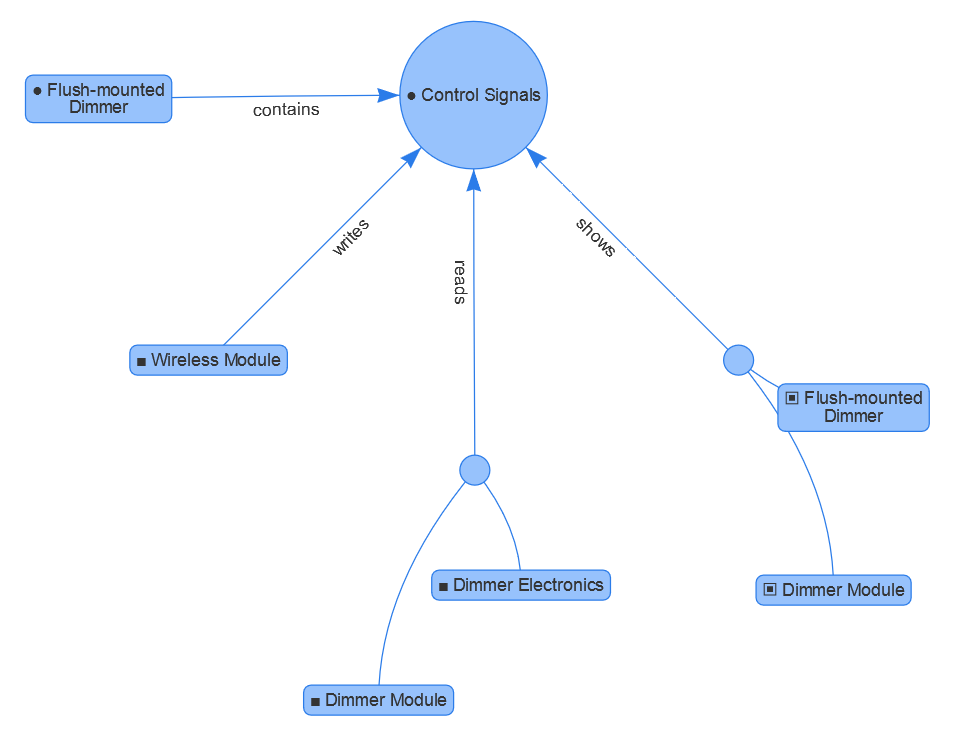

# SpecIF-Graph
Draws a neighborhood graph of a given [SpecIF](http://specif.de) resource. Input is a SpecIF data-set plus some options, output is a HTML-5 canvas appended to a specified DOM element.

## Example
... taken from the show-case: Integrated Specification of a Mechatronic System ['Dimmer'](http://se.reqif.net/apps/reader.html#pid/ACP-59c8a7730000bca80137509a49b1218b/sid/SP-59c8a7730000bca80137509a49b1218b/relations/MEl-5a9ce0310000bca801378176dc4744e8):

## Verwendete Librarys 
1. Requirejs: Nicht unbedingt notwendig.
2. Jquery: Nicht unbedingt notwendig.
3. Vis.js: Die Library zur Darstellung der Graphen.

## Javascript-Files
1.	Config: Hier werden einfach für Requirejs die Pfade zu den anderen Dateien als Alias gespeichert.
2.	Graph: Hier befindet sich die gesamte Logik zur Erzeugung des Graphen. Als Parameter wird nur der Index des darzustellenden objects-Element aus dem SpecIF benötigt. Dann erzeugt er mit Hilfe von SpecIF-Loader ein JSON-Objekt dieses objects. Er zeichnet den Graphen dann in ein Canvas, welches er in ein in den options übergebenes div-Element. 
3.	Graph-main: Das einzige Element das direkt im html-Dokument verlinkt werden muss. Es erzeugt automatisch beim Laden der Seite den Graphen. Je nachdem wie es verwenden werden soll, gibt es auch eine Version, bei der über einen Schieberegler zwischen den einzelnen objects-Indizes gewechselt werden kann; der Graph wird dabei sofort neu gezeichnet. Andernfalls kann der Code entfernt und die eine auskommentierten Zeile verwendet werden.
4.	SpecIFData: Liefert ein Beispiel einer SpecIF-JSON Datei als return-Wert.

## Acknowledgements
This work has been sponsored by [adesso AG](http://adesso.de), Berlin.
